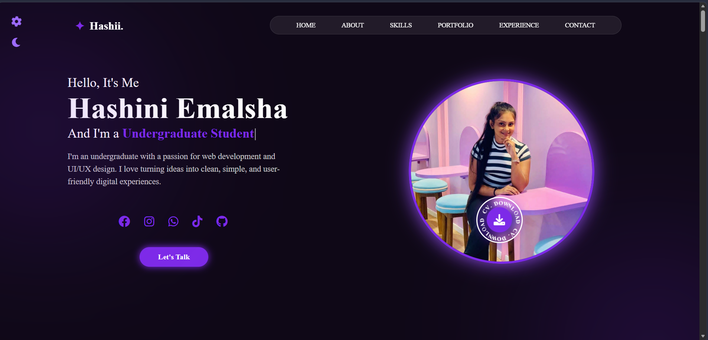

# 🌐 Personal Portfolio Website

A modern, responsive, and interactive personal portfolio website designed to showcase my educational background, technical skills, projects, certifications, and professional journey in Software Engineering and Web Development.

## 📸 Preview



## 👩‍💻 About Me

Hello! I'm **Hashini Emalsha**, an undergraduate Software Engineering student passionate about creating modern, user-friendly, and responsive web applications. This portfolio reflects my academic achievements, technical expertise, projects, and continuous learning journey in the field of Information Technology.

## ✨ Key Features

* Fully Responsive Design
* Interactive Navigation Menu
* Dark/Light Theme Toggle
* Modern UI/UX Design
* About Me Section
* Educational Qualifications
* Technical Skills Showcase
* Portfolio & Project Gallery
* Experience Timeline
* Certifications Section
* Contact Form & Information
* Social Media Integration
* Downloadable CV/Resume

## 🛠️ Built With

* HTML5
* CSS3
* JavaScript (ES6)
* Font Awesome

## 📂 Project Structure

```text
My_Personal_Portfolio/
│
├── assets/
│   ├── images/
│   ├── certificates/
│   ├── videos/
│   └── cv/
│
├── index.html
├── style.css
├── script.js
└── README.md
```

## 🎯 Project Objectives

This portfolio website was developed to:

* Present my academic and professional profile.
* Showcase my technical skills and achievements.
* Demonstrate my frontend web development capabilities.
* Highlight completed projects and certifications.
* Establish a professional online presence.

## 🚀 Getting Started

### Clone the Repository

```bash
git clone https://github.com/your-username/My_Personal_Portfolio.git
```

### Run the Project

1. Clone or download the repository.
2. Navigate to the project folder.
3. Open `index.html` in your preferred web browser.

## 📸 Portfolio Sections

* Home
* About
* Education
* Skills
* Portfolio
* Experience
* Certifications
* Contact

## 📱 Responsive Design

The website is optimized for:

* Desktop Devices
* Tablets
* Mobile Devices

## 📬 Contact

Feel free to connect with me through:

* GitHub
* LinkedIn
* Facebook
* Instagram
* WhatsApp
* TikTok

## 🌟 Future Enhancements

* Backend Integration
* Dynamic Project Management
* Blog Section
* Contact Form Database Support
* Multi-language Support

## 📄 License

This project is created for educational, learning, and portfolio purposes.

---

⭐ If you found this project helpful, consider giving it a star on GitHub!
